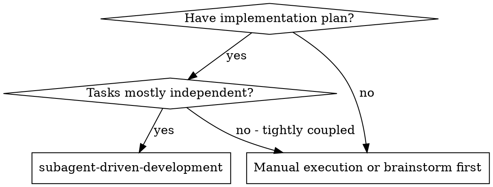
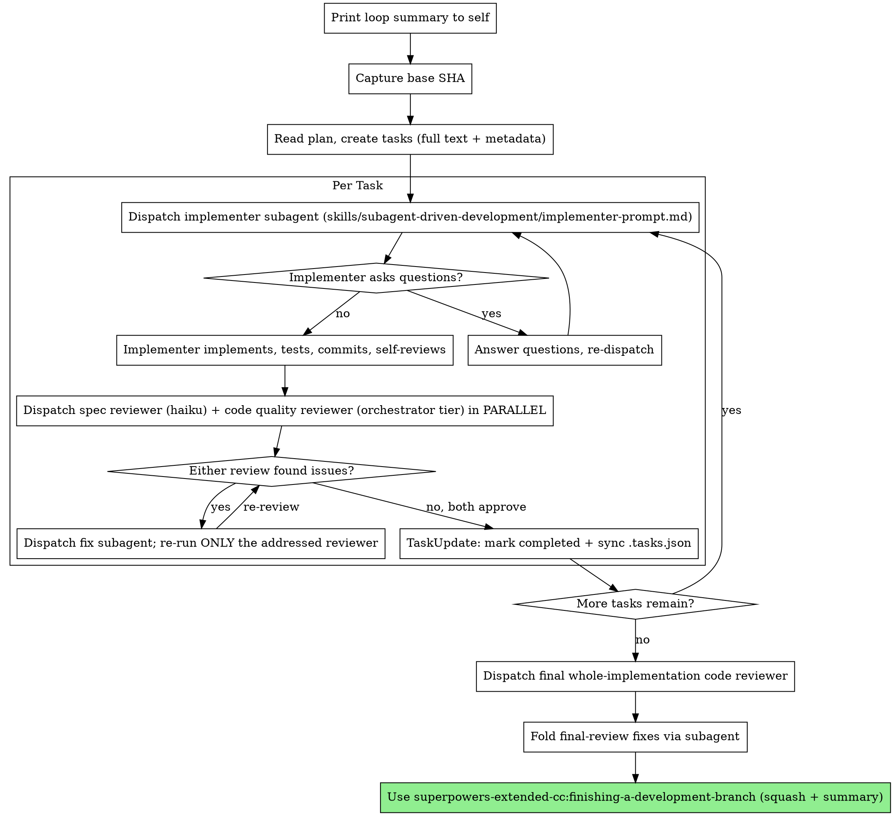

# Subagent-Driven Development

Execute a plan by dispatching a fresh subagent per task, with two reviews after each — spec compliance and code quality — dispatched in parallel.

**Why subagents:** You delegate tasks to specialized agents with isolated context. By precisely crafting their instructions and context, you ensure they stay focused and succeed at their task. They should never inherit your session's context or history — you construct exactly what they need. This also preserves your own context for coordination work.

**Core principle:** Fresh subagent per task + parallel two-track review (spec + quality) = high quality, fast iteration

**Continuous execution:** Do not pause to check in with your human partner between tasks. Execute all tasks from the plan without stopping. The only reasons to stop are: a BLOCKED status you cannot resolve, a genuinely critical question that prevents progress, or all tasks complete. "Should I continue?" prompts and progress summaries waste their time — they asked you to execute the plan, so execute it.

## Orientation: Summarize the Loop First

Your FIRST action on invoking this skill, before reading the plan or touching any task: print a concise numbered summary of the full loop to yourself. This keeps the review steps from being skipped under cognitive load. The summary enumerates:

1. Capture the base SHA.
2. Read the plan and build the task list (full text + metadata).
3. Per task: dispatch implementer → dispatch spec reviewer + code reviewer in parallel → dispatch a fix subagent for any findings and re-run only the addressed reviewer → mark the task completed.
4. After the last task: dispatch the final whole-implementation code reviewer → fold its fixes via a subagent.
5. Hand off to `finishing-a-development-branch`, which squashes and summarizes.

## When to Use



## Branch

Work on the current branch, whatever it is — usually `master` or `main`. Do not switch branches. If work belongs on a different branch, the user has already switched to it before invoking this skill.

## The Process



## Start: Capture Base SHA

Before creating any tasks, record the squash anchor:

```bash
git rev-parse HEAD
```

This is the base SHA — HEAD before any task work. Store it as the top-level `"baseSha"` field in the `.tasks.json` persistence file (see Building the Task List) so it survives `/compact` and the separate `finishing-a-development-branch` invocation, where it anchors the squash. It is distinct from the per-task `BASE_SHA` used inside the code quality reviewer prompt.

## Building the Task List

Read the plan once, extract every task with full text, and create a native task per plan task. Embed metadata as a `json:metadata` code fence at the end of each description — the `metadata` parameter on TaskCreate is accepted but not returned by TaskGet, so the fence is the only form that survives.

### User-Thrown Gates — Mechanical Detection + Tagging

Run this check for EVERY task you create. It takes seconds and is the cheapest part of the whole user-gate flow.

**Step 1 — Scan for gate-language.** For each of these, search the user's brief AND the task's Goal/Acceptance Criteria, case-insensitive, whole-word where reasonable:

| Bucket | Keywords / patterns |
|--------|---------------------|
| Verbs | `verify`, `prove`, `validate`, `confirm`, `ensure`, `check`, `gate` |
| Nouns | `verification gate`, `acceptance test`, `smoke test`, `end-to-end`, `E2E` |
| Scope | `first on one`, `then all`, `one before the rest`, `before proceeding`, `don't continue until` |
| Proof | `prove it works`, `make sure`, `demonstrate`, `show that` |

**Trigger rule** — a task is a user-thrown gate ONLY if:
- a **Nouns** match is found (these phrases are unambiguous gate nouns), OR
- a **Scope** match is found (commitment to ordering is a gate by itself), OR
- a **Verbs** match co-occurs with EITHER a Scope or a Proof match.

A **Verbs** match ALONE is not enough. Normal work briefs routinely say "validate the output" or "check that imports work" without asking for a gate. If the user wanted a gate, they committed to ordering ("do X before Y", "first on one"), named the artifact ("smoke test", "acceptance test"), or demanded proof ("prove it works", "show that"). One of those MUST be present in addition to the verb.

If no bucket matches, or only Verbs match → regular task, no tagging needed.

**Step 2 — Tag the task.** In the task's `json:metadata` fence:

1. Set `"userGate": true`.
2. Append `"user-gate"` to the `tags` array (create the array if absent).
3. If the user's brief specified the HOW concretely (named a command, entity, subagent, or observable), put it straight into `verifyCommand` and `acceptanceCriteria` — done.
4. If HOW is vague, set `"requiresUserSpecification": true` **only** when the verification sentence names no testable noun (function, command, entity, endpoint, file, log pattern) AND no concrete value (expected result, threshold, example input/output). One foothold — e.g. "verify each op with real inputs" — is enough for the agent to self-solve. The flag is for pure adjectives ("solid", "works", "good", "proper") where any guess is a shot in the dark.

**Step 3 — Add the prose banner** (mandatory whenever `userGate: true`). Near the top of the task description, right under **Goal:**, include verbatim:

> **USER-ORDERED GATE — NON-SKIPPABLE.** This task was requested by the user in the current conversation. It MUST NOT be closed by walking around it, by declaring it "verified inline", or by substituting a cheaper check. Close only after every item in `acceptanceCriteria` has been re-validated independently, with output captured.

**Tasks with declared evidence axes — set `requireEvidenceTokens`.** When a task's close is meaningful only if the coordinator has actually observed two (or more) labeled states, declare the axes in metadata. The `post-task-complete-revalidate` hook refuses the close unless at least one token from each axis appears in the close window. Examples:

- **Empirical refactor / A/B:** either explicit (`"requireEvidenceTokens": [["baseline","old","iter-0"], ["refactored","new","iter-1"]]`) or shortcut (`"requireABCompare": true`).
- **v2→v3 migration verification:** `"requireEvidenceTokens": [["v2","legacy"], ["v3","migrated"]]`.
- **Perf before/after:** `[["slow","unoptimized","p50=X"], ["fast","optimized","p50=Y"]]` — include the literal metric tags you expect the coordinator to post.
- **Multi-arm experiment:** `[["control"], ["variant-a"], ["variant-b"]]` — any number of axes.
- **Security pre/post fix:** `[["vulnerable","CVE-","before-patch"], ["patched","after-patch","hardened"]]`.

Without the axes, "looks good, keep going" closes are legal; with axes, the coordinator must produce evidence from each declared side. Pair with a concrete `verifyCommand` that actually runs both sides when possible (e.g. `diff <(old-cmd) <(new-cmd)`).

**Banner ↔ metadata invariant.** The banner goes inside the SAME TaskCreate `description` string as the `json:metadata` fence. For each task, the description must either carry `userGate: true` + banner + fence together, or none of them.

**Step 4 — Check acceptance criteria operational specificity.** Each criterion MUST name an observable. Vague ("integration works", "it passes") is not acceptable — rewrite to "sensor X reports idle", "HTTP 200 from `/health`", "setup.done file present", etc. If you cannot make a criterion operational, set `requiresUserSpecification: true` and let `/specify-gate` collect the real answer.

**Step 5 — Per-task isolation self-check.** For every task where you set `userGate: true` and DIDN'T set `requiresUserSpecification: true`, re-read ONLY that task's **Goal** sentence in isolation — pretend no other task exists. Does that sentence alone name an observable, a capture method, AND a pass/fail value? If no to any of the three, set `requiresUserSpecification: true` even if you already filled in a `verifyCommand` from context. Borrowing concreteness from sibling tasks is the failure mode this catches.

**Tag liberally when a real gate signal is present.** The three shades of gate (strict user gate / strict agent gate / gray in-between) all get the same tag — if the trigger rule above matches, err on the side of tagging. But do not read a gate into normal verbs: "validate", "check", "verify" on their own describe routine work. Over-tagging on real signals is harmless (extra metadata). Over-tagging on bare verbs produces a banner flood that drowns the real gates.

**Do not ask the user gate questions while building the task list.** The opinionated default is "tag it and move on". When the user's brief is vague about a gate's HOW, `requiresUserSpecification: true` routes the question to gate-check time, where `/specify-gate` handles it in 3-5 short multiple-choice prompts.

See `skills/shared/task-format-reference.md` → "User-Thrown Gates" for the full metadata schema (`userGate`, `tags`, `requiresUserSpecification`, `gateScope`, `failurePolicy`, `subagentBrief`), and `docs/user-gate-flow.md` for the end-to-end flow.

### TaskCreate description — full structured body

Every TaskCreate `description` MUST contain, verbatim, the same **Goal / Files / Acceptance Criteria / Verify** sections the plan `.md` holds for that task. Do NOT condense into a one-sentence summary. Do NOT move the AC to "see the plan doc". Do NOT omit `**Verify:**`. The description MUST end with the `json:metadata` code fence.

The implementer subagent reads the task description via TaskGet and works from it. A one-sentence description makes the subagent improvise AC. The plan `.md` is not a fallback — TaskGet does not read it.

**Self-check:** after TaskCreate for every task, open each description (via TaskGet or by reading `.tasks.json`) and confirm all four section headers (`**Goal:**`, `**Files:**`, `**Acceptance Criteria:**`, `**Verify:**`) AND the `json:metadata` fence are present. If any is missing → TaskUpdate the description to the full block.

```yaml
TaskCreate:
  subject: "Task N: [Component Name]"
  description: |
    **Goal:** [From task's Goal line]

    **Files:**
    [From task's Files section]

    **Acceptance Criteria:**
    [From task's Acceptance Criteria]

    **Verify:** [From task's Verify line]

    **Steps:**
    [Key actions from task's Steps — abbreviated]

    ```json:metadata
    {"files": ["path/to/file1.py"], "verifyCommand": "pytest tests/path/ -v", "acceptanceCriteria": ["criterion 1", "criterion 2"], "modelTier": "mechanical"}
    ```
  activeForm: "Implementing [Component Name]"
```

### Dependencies and persistence

After all tasks are created, set `blockedBy` relationships:

```
TaskUpdate:
  taskId: [task-id]
  addBlockedBy: [prerequisite-task-ids]
```

Write the persistence file co-located with the plan. If the plan is `docs/superpowers/plans/2026-01-15-feature.md`, the file is `docs/superpowers/plans/2026-01-15-feature.md.tasks.json`:

```json
{
  "planPath": "docs/superpowers/plans/2026-01-15-feature.md",
  "baseSha": "<sha captured at start>",
  "tasks": [
    {
      "id": 0,
      "subject": "Task 0: ...",
      "status": "pending",
      "description": "**Goal:** ...\n\n```json:metadata\n{\"files\": [\"path/to/file.py\"], \"verifyCommand\": \"pytest tests/ -v\", \"acceptanceCriteria\": [\"criterion 1\"], \"modelTier\": \"mechanical\"}\n```"
    }
  ],
  "lastUpdated": "<timestamp>"
}
```

Any new session resumes with `/superpowers-extended-cc:subagent-driven-development <plan-path>`, which reads `.tasks.json` and continues from where it left off.

## Dispatching with Metadata

When dispatching an implementer subagent:
1. Read the task's description via TaskGet — metadata is embedded as a `json:metadata` code fence at the end.
2. Parse the metadata JSON and map fields (files, acceptanceCriteria, verifyCommand) to the implementer prompt sections.
3. The implementer should receive ALL structured data — don't make them parse it from prose.

## Per-Task Review

After the implementer reports DONE, dispatch BOTH reviewers concurrently — they are read-only, so parallel dispatch is safe:

- **Spec compliance reviewer** — confirms the code matches the spec, nothing missing and nothing extra. Dispatch at the **cheap / mechanical / haiku tier** (explicit model override).
- **Code quality reviewer** — confirms the implementation is well-built. Dispatch at the **same tier as this orchestrator** (no model override). For a small, mechanical, or otherwise trivial task you MAY downgrade or skip the code quality reviewer.

Mark every reviewer and review-fix dispatch with `[sdd-review]` in the Agent call's `description`. That exempts them from the model-routing gate (see `hooks/pre-agent-model-routing`), so their dispatch-time tiers apply regardless of any active routing file.

**Fixes and convergence:**
- Any follow-up work a review requires is dispatched to a subagent. Do the fix yourself only when it is truly tiny and mechanical.
- After a fix, re-dispatch ONLY the reviewer whose issues were addressed.
- Mark the task completed once every reviewer that ran has approved, then sync `.tasks.json`.

## Model Selection (implementer)

Use the least powerful model that can handle each implementer task, to conserve cost and increase speed.

- Touches 1-2 files with a complete spec → cheap model. Most well-specified implementation tasks are mechanical.
- Touches multiple files with integration concerns → standard model.
- Requires design judgment or broad codebase understanding → most capable model.

## Handling Implementer Status

Implementer subagents report one of four statuses:

**DONE:** Proceed to the parallel review.

**DONE_WITH_CONCERNS:** The implementer completed the work but flagged doubts. Read the concerns first. If they bear on correctness or scope, address them before review. If they are observations (e.g., "this file is getting large"), note them and proceed to review.

**NEEDS_CONTEXT:** The implementer needs information that wasn't provided. Provide the missing context and re-dispatch.

**BLOCKED:** The implementer cannot complete the task. Assess the blocker:
1. If it's a context problem, provide more context and re-dispatch with the same model.
2. If the task requires more reasoning, re-dispatch with a more capable model.
3. If the task is too large, break it into smaller pieces.
4. If the plan itself is wrong, escalate to the human.

**Never** ignore an escalation or force the same model to retry without changes. If the implementer said it's stuck, something needs to change.

## Escalating Questions to Your Human Partner

Before ANY execution-time AskUserQuestion — plan-scripted or relayed from an implementer:
1. Re-read the plan header's "User decisions (already made)". If a recorded decision answers the question, use that answer instead of asking.
2. If you do ask: name the artifact AND its role/state from the plan's facts (not just its name), and make each option description say what changes and what stays the same. Your human partner does not hold the plan in their head — an unanchored recommendation reads as a new proposal.

## End of Run

After the last task is complete:
1. Dispatch the final whole-implementation code reviewer (orchestrator tier) over the entire diff.
2. Fold any fixes it requires via a subagent.
3. Invoke `finishing-a-development-branch`, passing both the base SHA (or the `.tasks.json` path that holds it) and the plan/spec path — it squashes the work and summarizes.

## Prompt Templates

- `skills/subagent-driven-development/implementer-prompt.md` — Dispatch implementer subagent
- `skills/subagent-driven-development/spec-reviewer-prompt.md` — Dispatch spec compliance reviewer subagent
- `skills/subagent-driven-development/code-quality-reviewer-prompt.md` — Dispatch code quality reviewer subagent

## Example Workflow

```
You: I'm using Subagent-Driven Development to execute this plan.

[Print loop summary to self]
[Capture base SHA: git rev-parse HEAD]
[Read plan file once: docs/superpowers/plans/feature-plan.md]
[Create a task per plan task, full text + metadata; write .tasks.json with baseSha]

Task 1: Hook installation script

[Dispatch implementer with full task text + context]
Implementer: "Before I begin - should the hook be installed at user or system level?"
You: "User level (~/.config/superpowers/hooks/)"
Implementer:
  - Implemented install-hook command, added tests (5/5), self-review added --force, committed

[Dispatch spec reviewer (haiku) + code quality reviewer (orchestrator tier) in parallel]
Spec reviewer: ✅ Spec compliant
Code reviewer: ✅ Approved
[Mark Task 1 complete, sync .tasks.json]

Task 2: Recovery modes

[Dispatch implementer; implements verify/repair, 8/8 tests, commits]
[Dispatch spec reviewer + code reviewer in parallel]
Spec reviewer: ❌ Missing progress reporting; extra --json flag
Code reviewer: ⚠️ Magic number (100)

[Dispatch fix subagent for the spec findings; re-run ONLY the spec reviewer]
Spec reviewer: ✅ Spec compliant
[Dispatch fix subagent for the magic number; re-run ONLY the code reviewer]
Code reviewer: ✅ Approved
[Mark Task 2 complete, sync .tasks.json]

...

[After all tasks]
[Dispatch final whole-implementation code reviewer; fold any fixes via subagent]
[Invoke finishing-a-development-branch with baseSha + plan path]
```

## Red Flags

**Never:**
- Switch branches, or refuse to work because the branch is `master`/`main` — work on the current branch
- Skip a review (spec compliance OR code quality), except a deliberately-skipped code quality review on a trivial task
- Proceed with unfixed issues
- Dispatch parallel implementers whose tasks' `files` overlap or that appear in each other's `blockedBy` chain (write conflicts — disjoint tasks and read-only agents MAY run in parallel; see Bounded Parallel Dispatch)
- Make a subagent read the plan file (provide full text instead)
- Skip scene-setting context (the subagent needs to understand where the task fits)
- Ignore subagent questions (answer before letting them proceed)
- Accept "close enough" on spec compliance (spec reviewer found issues = not done)
- Let implementer self-review replace actual review (both are needed)
- Do review follow-up yourself when it is more than tiny and mechanical — dispatch a fix subagent
- Move to the next task while any review that ran has open issues

**If a reviewer finds issues:**
- Dispatch a fix subagent with specific instructions
- Re-run only the reviewer whose issues were addressed
- Repeat until that reviewer approves

## Bounded Parallel Dispatch

Overlapping writers are forbidden; parallelism is not. Dispatch concurrently when every running agent passes the disjointness test:

- **Read-only agents are always parallel-safe**: the per-task spec and code reviewers, audits, log analysis, verification gates, long-running test suites.
- **Implementers may run concurrently ONLY when** their tasks' `files` lists share no path AND neither task appears in the other's `blockedBy` chain. The `files` metadata IS the test — no overlap means no conflict.
- **Never** two writers on one file, and never use parallelism to skip reviews: each task still gets its own spec + quality review as it completes.
- Mark every parallel task `in_progress` BEFORE dispatching its agent — model routing resolves each dispatch against the union of in-progress tiers, and an unmarked task's dispatch will be blocked against the wrong tier.
- When overlap is uncertain, serialize. The sequential per-task loop is the default; parallelism among implementers is the optimization.

## Task Persistence Sync

After marking each task completed via `TaskUpdate`, update `.tasks.json` to stay in sync:

1. Read `<plan-path>.tasks.json`
2. Set the task's `"status"` to `"completed"`
3. Set `"lastUpdated"` to the current ISO timestamp
4. Write the file back

This keeps cross-session resume correct — without it, a new session loading `.tasks.json` sees completed tasks as `"pending"`.

## Integration

**Workflow skills:**
- **superpowers-extended-cc:writing-plans** — Creates the plan this skill executes
- **superpowers-extended-cc:requesting-code-review** — Code review template for reviewer subagents
- **superpowers-extended-cc:finishing-a-development-branch** — Squashes and summarizes after all tasks

**Subagents should use:**
- **superpowers-extended-cc:test-driven-development** — Subagents follow TDD for each task
